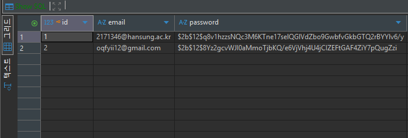

# 설치해야하는 라이브러리
pip install fastapi
pip install "uvicorn[standard]"
pip install sqlalchemy
pip install psycopg2-binary
pip install "python-jose[cryptography]"
pip install "passlib[bcrypt]"
npx expo install expo-secure-store
npm install axios   

# 실행(cmd)
uvicorn app.main:app --reload
npm start 

# 작동원리
index.tsx(엡)에서 email,pw 입력 -> FastAPI(서버)에서 main.py에서 DB 연결 후 이메일 일치한지 확인 -> security.py에서 비번 일치한지 확인 -> 토큰 생성 함수 호출(담긴 내용: 이메일, 서버만 알고 있는 SECRET_KEY로 이 정보들 암호화 후 JWT 토큰 생성 <=[.env]에서 확인 가능)
-> 로그인 화면에서 home.tsx화면으로 이동

# 부가 설명

위 사진처럼 회원가입 시 DB 테이블에 저장됨